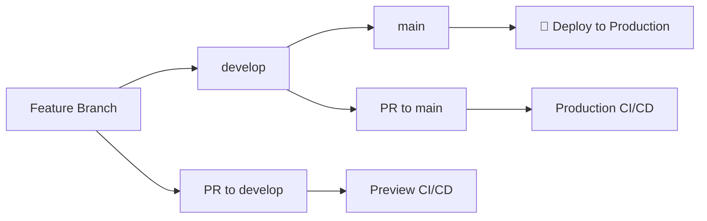

# CI/CD Workflows

This project uses GitHub Actions for continuous integration and deployment. We have two main workflows:

## 🚀 Production CI/CD (`deploy.yml`)

**Triggers:**

- Push to `main` branch
- Pull requests to `main` branch

**Features:**

- ✅ Multi-Node.js version testing (18, 20)
- 🔍 Linting with ESLint
- 📝 Code formatting validation with Prettier
- 🧪 TypeScript compilation check
- ✅ Unit tests (if available)
- 🏗️ Production build
- 📦 Build artifact storage
- 💬 Automated PR comments

## 🔍 Preview Deployment (`preview.yml`)

**Triggers:**

- Push to `develop` branch
- Pull requests to `develop` branch

**Features:**

- 🔍 Quality checks for development
- 🏗️ Preview builds
- 📦 Temporary artifact storage (7 days)
- 💬 Detailed PR status comments
- 🌐 Ready for staging deployment

## Workflow Status

| Branch  | Status                                                                                                                         |
| ------- | ------------------------------------------------------------------------------------------------------------------------------ |
| Main    |         |
| Develop |  |

## Branch Strategy



## Required Scripts

Make sure your `package.json` includes these scripts:

```json
{
    "scripts": {
        "build": "tsc -b && vite build",
        "lint": "eslint \"src/**/*.{ts,tsx,js,jsx}\"",
        "format:check": "prettier --check \"src/**/*.{ts,tsx,js,jsx,json,scss,css,md}\"",
        "test": "vitest" // Optional
    }
}
```

## Environment Variables

For deployment, you may need to set these environment variables in GitHub repository settings:

- `NODE_ENV`: Set to `production` for main branch builds
- Add any API keys or deployment-specific variables as needed

## Deployment

### Automatic Deployment (Production)

- Merges to `main` trigger production builds
- Build artifacts are stored for 30 days
- Ready for automatic deployment to production servers

### Preview Deployment (Staging)

- Merges to `develop` trigger preview builds
- Build artifacts are stored for 7 days
- Can be manually deployed to staging environments

## Troubleshooting

### Build Failures

1. Check linting errors: `npm run lint`
2. Check formatting: `npm run format:check`
3. Check TypeScript: `npx tsc --noEmit`
4. Check build: `npm run build`

### PR Checks

- All quality checks must pass before merging
- Automated comments provide build status
- Review build artifacts in GitHub Actions

## Local Development

To run the same checks locally before pushing:

```bash
# Install dependencies
npm ci

# Run all checks
npm run lint
npm run format:check
npx tsc --noEmit
npm run build

# Fix issues
npm run lint:fix
npm run format
```
